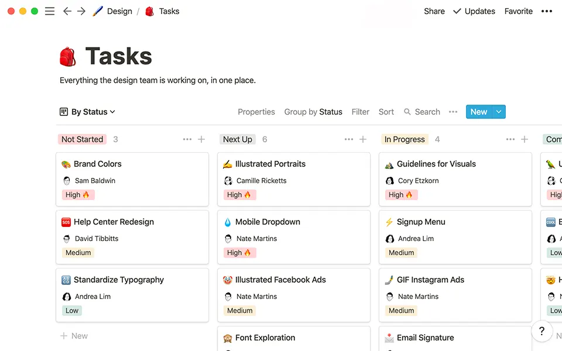

# 📄 Notion

Notion 공식 웹사이트 클론 코딩 👉 [Demo](https://imjone.github.io/notion/)

<br/>

## 📢 프로젝트 개요

첫 웹 프로젝트로 진행한 Notion 클론 코딩 사이트입니다.<br />
저의 최애 어플 중 하나라서 관련된 프로젝트를 하나쯤 진행해보고 싶었습니다.<br />
모바일 및 태블릿, PC 환경에서 모두 보기 편하도록 반응형으로 제작하였습니다.

<br/>

## 🗨️ 사용 기술

<p>
  
  
  
</p>

<br/>

## 📋 주요 기능

- 모바일 환경을 고려한 반응형 작업
- 스크롤값에 따른 섹션 등장 애니메이션
- 클릭 시 페이지 최상단으로 이동하는 버튼
- 카테고리별 샘플 이미지 필터링 기능
- 스와이퍼 라이브러리를 활용한 슬라이더

<br/>

## 💻 소스 코드

전체 코드 보러 가기 👉 [Notion](https://www.notion.so/imjone/Notion-7260e6b7c68e467995630c2e52b664d5?pvs=4)

### 📍 스크롤 헤더 & 메뉴바

페이지 첫 스크롤 시, 헤더와 메뉴바의 스타일이 동적으로 변경됩니다. (box-shadow, height)<br>
`scroll` 이벤트를 등록하여 스크롤값이 header의 높이값보다 클 경우 CSS 클래스를 부여하고,<br>
그렇지 않을 경우 클래스를 다시 제거하는 식으로 구현하였습니다.

```javascript
const header = document.querySelector('header');
const headerHeight = header.offsetHeight;
const navbarMenu = document.querySelector('.navbar_menu');

document.addEventListener('scroll', () => {
  if (window.scrollY > headerHeight) {
    header.classList.add('scrollHeader');
    if (window.innerWidth <= 768) {
      navbar.classList.add('scrollNav');
    }
  } else {
    header.classList.remove('scrollHeader');
    if (window.innerWidth <= 768) {
      navbar.classList.remove('scrollNav');
    }
  }
});
```

### 📍 홈 섹션 투명도 조절

스크롤 비율에 따라 투명도가 적절하게 할당되도록 하기 위해서,<br />
현재 스크롤값(`window.scrollY`)을 home 섹션의 높이값으로 나눈 후 1에서 빼주었습니다.<br />
연산 결과에 따라 opacity 속성의 값이 동적으로 할당됩니다.

```javascript
const homeInner = document.querySelector('#home .inner');
const homeHeight = home.offsetHeight;

document.addEventListener('scroll', () => {
  homeInner.style.opacity = 1 - window.scrollY / homeHeight;
  // opacity (0 : transparent, 1 : untransparent)
});
```

### 📍 이미지 필터링

카테고리별로 적절한 샘플 이미지를 보여주는 뷰어 기능을 구현하였습니다.<br />
먼저 각각의 카테고리마다 index 역할을 하는 `data-order` 속성을 정의합니다.<br />
각 요소 클릭 시, 해당 속성의 값과 동일한 파일명을 가진 이미지가 보여지게 됩니다.

```html
<!-- Category -->
<ul class="uses_album_categories">
  <li data-order="1">✏️ 메모</li>
  <li data-order="2">📌 작업</li>
  <li data-order="3">📋 보고서</li>
  <li data-order="4">🎨 디자인</li>
  <li data-order="5">📚 메뉴얼</li>
</ul>

<!-- Image -->
<div class="uses_album_photo">
  
</div>
```

```javascript
const albumCategory = document.querySelector('.uses_album_categories');
const albumPhoto = document.querySelector('.uses_album_photo img');

albumCategory.addEventListener('click', e => {
  const target = e.target.nodeName === 'LI' ? e.target : e.target.parentNode;
  const order = target.dataset.order;
  if (target.nodeName === 'LI') albumPhoto.setAttribute('src', `img/uses/uses_photo${order}.webp`);
  else return;
});
```

<br/>

## 😊 배운 점 및 느낀 점

- 애니메이션 라이브러리의 매력과 편리함을 알게 되었습니다.
- 모바일 시대인 만큼 초기 반응형 스타일 기획이 정말 중요하다고 느꼈습니다.
- 자바스크립트와 조금 더 친해질 수 있는 좋은 계기가 되었습니다.
